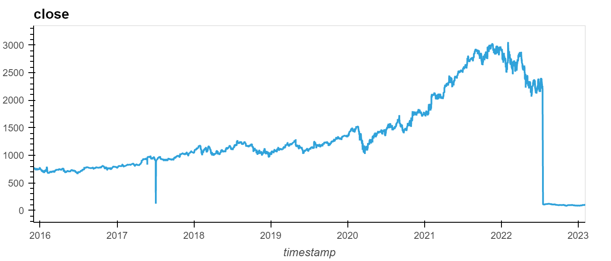
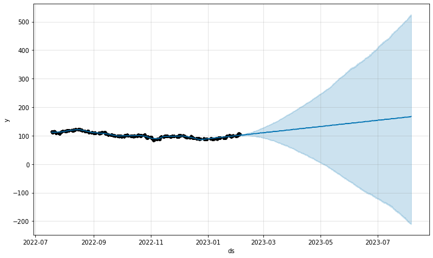
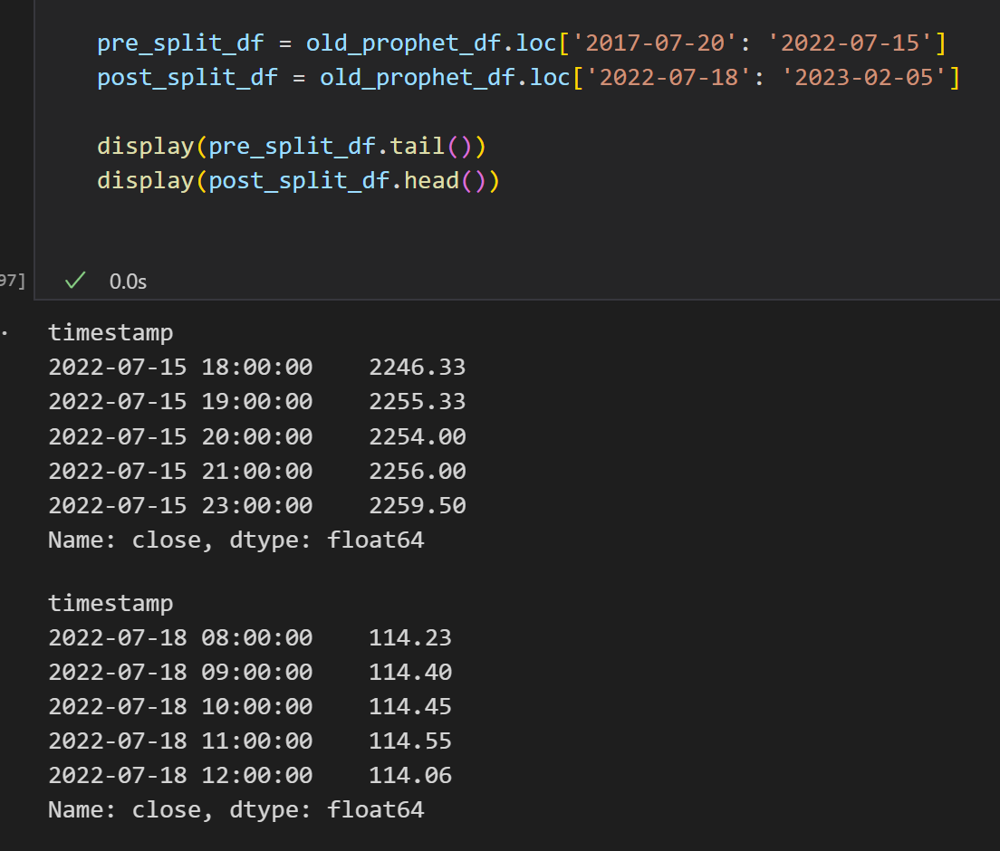
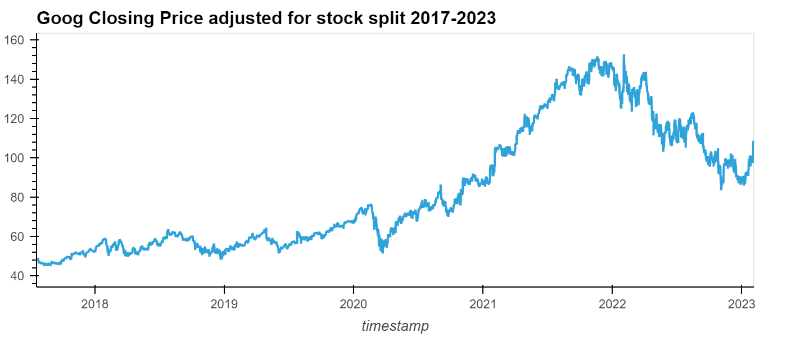
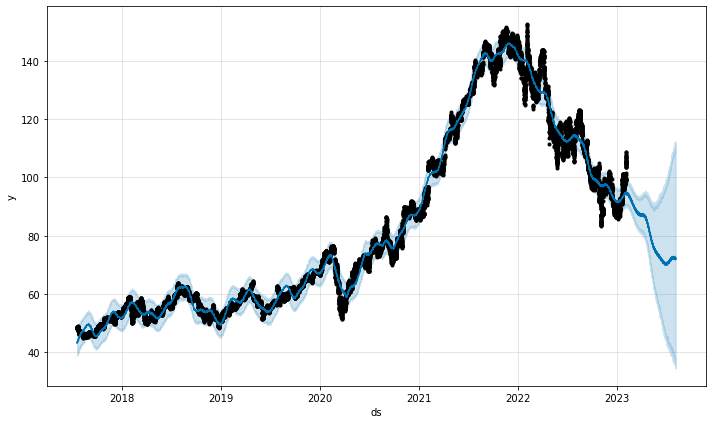

# Stock_Predictions_2023
Prophet is used to predict stock prices for GOOG over the next six months from both short and long fitting period.

Note: This is in no way shape or form certified investment advice. This is solely a prospective analysis using Prophet

# Technologies
```python
Python 3.9
```


| [Pandas](https://pandas.pydata.org/) | [Prophet](https://facebook.github.io/prophet/) | [Jupyter Labs](https://jupyter.org/) | [Alpaca](https://alpaca.markets/)  |
|:-----------------:|:-------------:|:---------------:|:---------------:|
|  |   |       |     |
| Data analysis and manipulation tool    | Time-series forecasting tool         | Interactive web-based IDE      | Online trading platform that houses market data            |


# Overview

Reading the close price for Google as far back as the Alpaca API allow yields closing prices as shown below:



As you can see there is a point in 2017 where the data has an inconsistency and the date where Google split its stock in a 20-1 split. This stock split has not been standardized in the Alpaca database and it needs to be adjusted as to reflect an accurate price fluctuation over time. I decided to take an approach where I would run a prediction with only the last year's worth of closing prices, right after the split occurred.

Source: [Google Stock Split CNN Article](https://www.cnn.com/2022/07/18/investing/google-alphabet-stock-split/index.html)

# Short Prediction

Running a time-series prediction from 2022-07-18, the date of the stock split, to 2023-02-05, the day I did the analysis yielded the following graph:

### 6 Month Closing Price Prediction for GOOG with One year fitting window


This short time frame gives an incredibly high variability in outcomes for stock price over a six month time frame. This caused me to pivot, seeking to incorporate the price data before the stock split.

# Data Readjustment

In order to accurately create a time-series prediction I split the data into two separate dataframes, one before the stock split and one after.



Then I adjusted the price before the stock split by dividing by 20 - the conversion rate for the recent split. After I rejoined the two dataframes. Here is the plot showing the adjusted closing prices had they been at a 20-1 split before it actually occured.



# Long Prediction

Using the adjusted values I predicted what the closing price would look like six-months from today with Prophet.

### 6 Month Closing Price Prediction for GOOG with fitting window from 2017-2023 (6 years)


This is prediction has a better scope and seems like a more accurate representation of what could happen in the next half-year cycle. 

# Conclusion

This Yahoo Finance [article](https://www.yahoo.com/now/morgan-stanley-chief-strategist-thinks-201052387.html) claims that Mike Wilson, the Chief Investment Officer at Morgan Stanley, believes that the markets are looking "frothy" - meaning most investments are "trading at valuations above their fundamentals". With this is mind it would be a safe bet that the markets are most likely going to continue to follow this downward trend predicted using Prophet. Using GOOG stock as an analog for the wider technology market it could also be assumed that most other tech stocks would follow this same pattern. 

Advice from the article says to hold off on investing in American equities as of now. 

Advice from 


